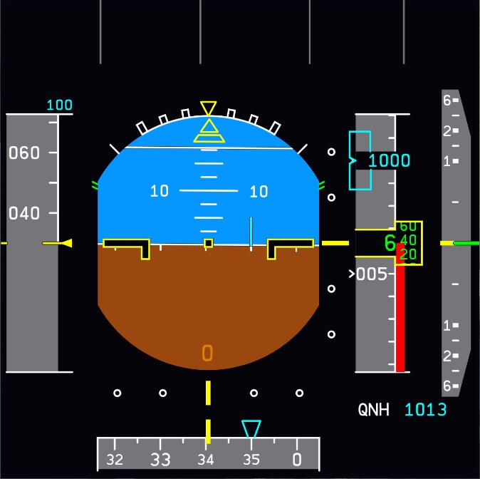

# Primary Flight Display (PFD)

## Description

The Primary Flight Display (PFD) is the main aviation instrument for the pilots. It provides information for:

- Attitude
- Sideslip Indication
- Airspeed (Knots or Mach) and speed trend
- Altitude (baro and radio)
- Vertical Speed
- Heading and Track
- Autopilot / Flight Director Guidance
- Sidestick Order Indication
- Flight Mode Annunciator and Flight Modes FMGS
- Deviations (vertical and lateral)
- Radio navigation (ILS, DME, etc.)
- Various scales and limits (bank limits, max sidestick deflection, pitch, etc.)

## Interactive PFD

    
    <!-- OVHD AFT -->
    <a href="/pilots-corner/a32nx-briefing/pfd/fma/">
Flight Mode Annunciators
</a>
    <a href="/pilots-corner/a32nx-briefing/pfd/altitude-indicator/">
Altitude Indicator
</a>
    <a href="/pilots-corner/a32nx-briefing/pfd/vertical-speed/">
Vertical Speed Indicator
</a>
    <a href="/pilots-corner/a32nx-briefing/pfd/baro-ref/">
Barometric Reference
</a>
    <a href="/pilots-corner/a32nx-briefing/pfd/artificial-horizon/">
Attitude and Guidance
</a>
    <a href="/pilots-corner/a32nx-briefing/pfd/speedtape/">
Actual Airspeed Reference Line and Scale
</a>
    <a href="/pilots-corner/a32nx-briefing/pfd/heading-ref/">
Heading Reference Line and Scale
</a>
    <a href="/pilots-corner/a32nx-briefing/pfd/ils-indicator/">
Loc and G/S Deviation Scale
</a>
    <a href="/pilots-corner/a32nx-briefing/pfd/ils-indicator/">
Loc and G/S Deviation Scale
</a>

---

## Chapters

- [Flight Mode Annunciators](fma.md)
- [Actual Airspeed Reference Line and Scale](speedtape.md)
- [Attitude and Guidance](artificial-horizon.md)
- [Altitude Indicator](altitude-indicator.md)
- [Barometric Reference](baro-ref.md)
- [Heading Reference Line and Scale](heading-ref.md)
- [Vertical Speed indicator](vertical-speed.md)
- [Flags and Messages](flags-messages.md)
