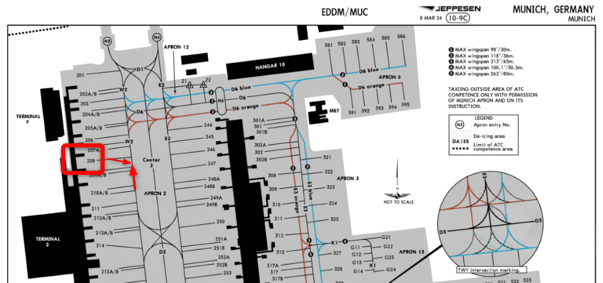
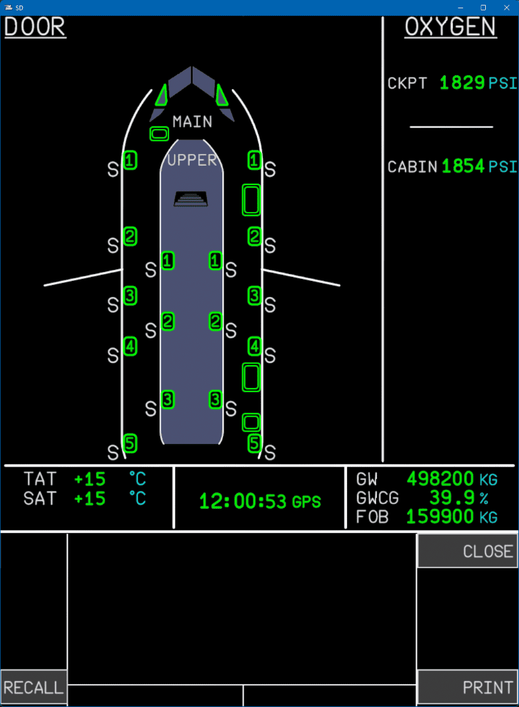
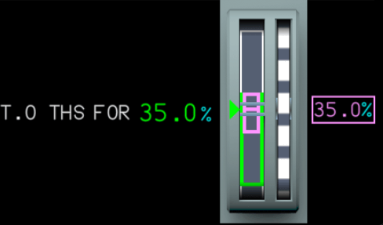
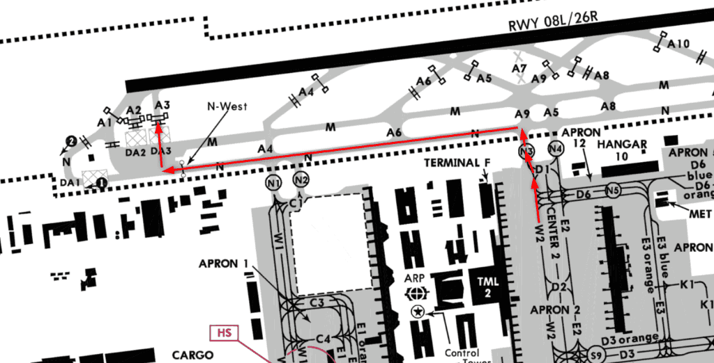
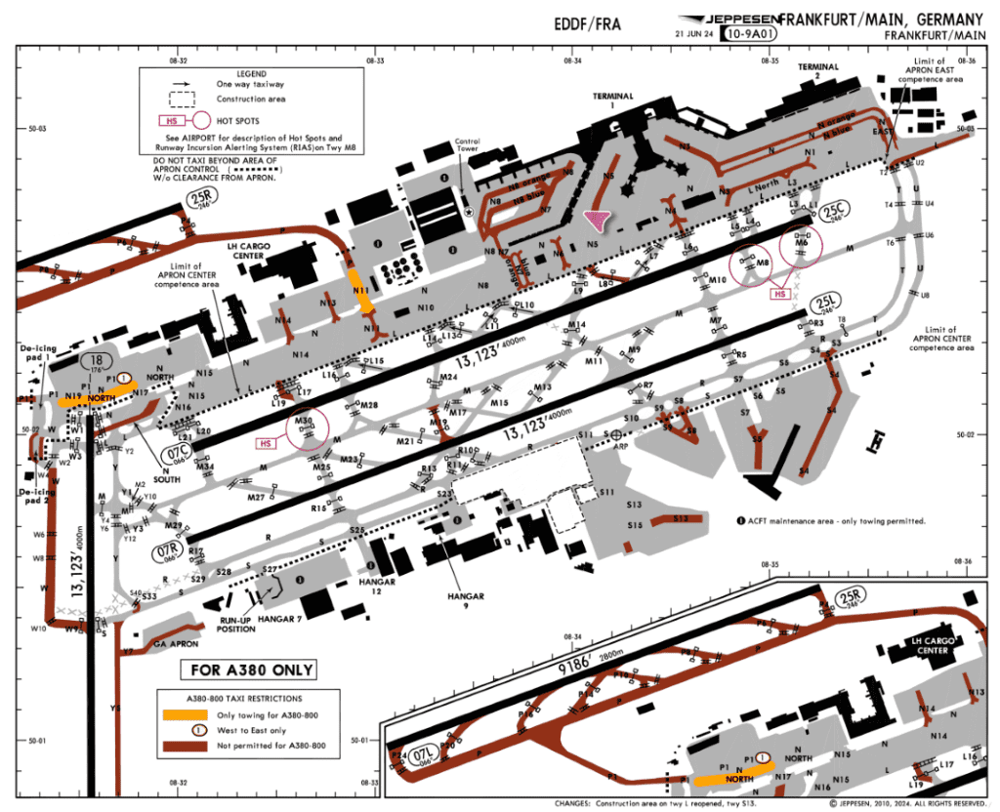
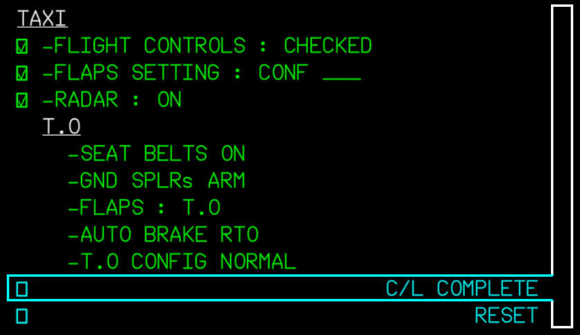

<link rel="stylesheet" href="/stylesheets/bg.css">

# Engine Start and Taxi

This guide will explain the correct procedures to carry out a pushback with engine start and perform a safe taxi to 
the departure runway.

!!! warning "Disclaimer"
    
This is for simulation purposes only.

    The level of detail in this guide is meant to get an Airbus A380 beginner safely from the terminal to the runway 
    hold short point.

    A *beginner* is defined as someone familiar with flying a GA aircraft or different types of airliners. Aviation 
    terminology and know-how is a requirement to fly any airliner, even in Microsoft Flight Simulator.

---

## Prerequisites

- IFR clearance obtained
- The aircraft is secure
- APU MASTER SW - `Set to ON` and the APU is available

At this time, we may request for clearance to push and start from ATC.

[Download FlyByWire Checklist](../assets/sop/FBW_A380X_Checklist.pdf){ .md-button }

---

## Chapters / Phases

This guide will cover these chapters:

1. [Before Pushback and Start](#before-pushback-and-start)
2. [Pushback Clearance and Preparation](#pushback-clearance-and-preparation)
2. [Pushback](#pushback)
2. [Engine Start](#engine-start)
3. [After Engine Start](#after-engine-start)
4. [Flight Controls Check](#flight-controls-check)
5. [Taxi](#taxi)
6. [General Resources](#general-resources)

---

### Before Pushback and Start

Once all passengers have boarded and secured, we are ready to begin pushback.

??? tip "What and Why"
    Before pushback the flight crew need to ensure the external power is not used any more so the ground crew can
    safely disconnect the aircraft from the ground power. The same goes for the low-pressure ground carts as keeping 
    them connected during engine start could cause faulty triggers. 

`EXTERNAL POWER (1, 2, 3, 4).....................DISCONNECT and CHECK AVAIL` 
`EXTERNAL POWER DISCONNECTION (GROUND CREW) ....................... REQUEST` 
`LOW PRESSURE GROUND CARTS ............................. CHECK DISCONNECTED` 

??? tip "How and Where"
    These actions are performed on the overhead panel. The external power is disconnected by pressing the respective 
    button on the overhead panel. The external power connections and low-pressure ground carts are disconnected by the 
    ground crew.

    [Flight Deck Overview](../../a380x-briefing/flight-deck){ .md-button }

    Use the Flight Deck Overview to locate the items mentioned above. The Flight Deck Overview is a
    clickable cockpit that will show you where each item is located.
    
    * [External Power](../../a380x-briefing/flight-deck/ovhd/elec)

### Pushback Clearance and Preparation

??? tip "What and Why"

    Contact ground ATC and inform them you are ready to push and start. If you are on a network such as VATSIM, a typical
    response from ground would give you clearance for your request and a direction to face (or any direction). 

`PUSHBACK/START UP CLEARANCE ....................................... OBTAIN` 
`BEACON ................................................................ ON` 
`WINDOWS AND DOORS ............................................CHECK CLOSED` 
`SLIDES ............................................................. ARMED` 
`THRUST LEVERS ....................................................... IDLE` 
`PARKING BRAKE ........................................................ OFF` 

??? tip "How and Where"
    At EDDM on gate 208 and runway 08L you could expect the following push and start clearance from ground:

    "** Your Aircraft Callsign**, Ground. You are clear to push and start onto Whiskey 3 facing north."

    At th   is point, we may begin pushback away from the terminal onto the taxiway Alpha 3.

    {loading=lazy}
    Copyright © 2024 Navigraph / Jeppesen "Navigraph Charts are intended for flight simulation use only, not for navigational use."
    
    **Windows, Doors and Slides**
    
    To check windows, doors and slides, you can use the [SD](../../a380x-briefing/flight-deck/main-panel/sd) page on 
    the system display. The SD page will show you the status of the doors and slides. 
    
    {loading=lazy}

    [Flight Deck Overview](../../a380x-briefing/flight-deck){ .md-button }

    Use the Flight Deck Overview to locate the items mentioned above. The Flight Deck Overview is a
    clickable cockpit that will show you where each item is located.
    
    * [Beacon](../../a380x-briefing/flight-deck/ovhd/ext-lt)
    * [Thrust Levers](../../a380x-briefing/flight-deck/pedestal/throttle)
    * [Parking Brake](../../a380x-briefing/flight-deck/pedestal/parking-brake)
    
`BEFORE START CHECKLIST .......................................... COMPLETE` 
??? note "Before Start Checklist"
    The Airbus A380 has a built-in checklist system that can be accessed via the 
    [Engine Warning Display (EWD)](../../a380x-briefing/flight-deck/main-panel/ewd).
    
    To activate it you need to press the `C/L` button on the 
    [ECAM Control Panel (ECP)](../../a380x-briefing/flight-deck/pedestal/ecam-cp).

    You can navigate through the checklist by using the `UP` and `DOWN` buttons on the ECP. You can check/uncheck items
    by pressing the buttons with the check mark on the ECP.

    Some items are autosensed by the aircraft and will be checked automatically (e.g. Beacon).

    {loading=lazy}

### Pushback

There are several options available to you in MSFS to achieve a successful pushback.

- The [flyPad (EFB) ground control screen](../../../aircraft/common/flypados3/ground.md#pushback)
- MSFS built in ATC pushback controls
- Third-party pushback add-ons

This guide assumes that the flyPad's pushback functionality is used. 

Click below to learn more about the flyPad and how to use it for pushback.

??? tip "How to Pushback" 
    ### How-to Pushback

    The FlyByWire A380X has a ground operations page on its built-in flyPad EFB (Electronic Flight Bag). This page allows 
    controlling the pushback of the aircraft and other useful ground operations such as calling the Jetway, baggage or 
    catering, etc.
    
    Although Microsoft Flight Simulator also has some pushback functionality built into the default ATC service, this guide 
    will only cover the A32NX pushback functionality.
    
    {loading=lazy}
    
    !!! block ""
        {loading=lazy align=left width=30%}
        
        After we received clearance to pushback, we will call the pushback tug by pressing the `Call Tug` button on the flyPad.
    
        If a pushback tug is available at this gate or stand, it will then start attaching itself to the nose wheel.
    
        !!! warning ""
            Some airports / gates / stands do not show a tug. This functionality still works, and you can push back as if a 
            tug is attached. It looks like an invisible tug is pushing the aircraft.
    
    After the tug is attached to the nose wheel, we can start pushing back by using the control buttons or the rudder and elevator controls.
    
    See the flyPad documentation for more details: [flyPad Pushback](../../../aircraft/common/flypados3/ground.md#pushback)

---

## Engine Start

Once we are clear of the terminal and/or the ground crew has notified the flight crew it is clear to start engines, we 
can proceed with the following steps.

`ENGINE START selector .......................................... IGN START` 
??? Note "ENGINE START Selector"
    The engine page on the system display should appear. It's recommended to wait 10 seconds before setting the engine 
    masters lever to the ON position. This waiting time ensures a series of tests conducted to the engines in order to 
    detect a fault.
`START ENGINES 1 and 2 ........................................... ANNOUNCE` 
`ENGINE MASTER 1 then 2................................................. ON` 
??? Note "ENGINE START"
    Any engine can be started first, at the pilots discretion.
`WHEN AVAIL: ENGINE IDLE PARAMETERS .......................... CHECK NORMAL` 
??? note "ENGNIE IDLE PARAMETERS"
    The engine idle parameters are displayed on the engine page on the system display. The engine idle parameters should 
    be checked to ensure the engines are starting normally.

    - ENG reported `AVAIL`  
    - THR (thrust) is at roughly 4.2%
    - N1 is at roughly 21%
    - EGT settles at about 367°C
    - N2 is at roughly 63.8%
    - N3 is at roughly 63.1%
    - FF is at roughly 670kg/h

`START ENGINES 3 and 4 ........................................... ANNOUNCE` 
`ENGINE MASTER 3 then 4................................................. ON` 
`WHEN AVAIL: ENGINE IDLE PARAMETERS .......................... CHECK NORMAL` 

??? tip "How and Where"
    [Flight Deck Overview](../../a380x-briefing/flight-deck){ .md-button }

    Use the Flight Deck Overview to locate the items mentioned above. The Flight Deck Overview is a
    clickable cockpit that will show you where each item is located.
    
    * [Engine Start Selector](../../a380x-briefing/flight-deck/ovhd/eng-start)
    * [Engine Master](../../a380x-briefing/flight-deck/pedestal/engine-master)

??? note "Note: Bleed Air"
    The A380 needs pressurized air to start the engines. This pressurized air is usually generated by the APU for the 
    start of the engines. This is called bleed air, as it is a byproduct of a running jet engine where pressurized air 
    is taken from the engine to be used on other systems.

    **To start the engines, you need to have the APU available and the APU Bleed ON - see [Cockpit Preparation](./02_cockpit-preparation.md#overhead-panel-center-bottom-to-top).**

    You can also use a so called [Ground Air Starter Unit (ASU)](../../../aircraft/common/flypados3/ground.md) to start 
    the engines which you can connect to the aircraft using the Ground Services page of the flyPad. 

    You can start the second engine with bleed air (X-Bleed) from the first engine. It would usually not be used at the 
    gate as the APU would be running anyway, but it is used during single engine taxi when the second engine is started 
    while rolling to the runway.
    
    [//]: # (TODO)
    Please refer to the [A32NX Crossbleed Engine Start Guide](../../../pilots-corner/a32nx/a32nx-advanced-guides/engines/crossbleed-start.md)
    for more information on how to start the engines using crossbleed on the A380 as the procedure is similar.

---

## After Engine Start

??? tip "What and Why"
    After the engines have been started, the flight crew need to ensure that all systems are functioning correctly and 
    that the aircraft is ready for taxi.

`ENGINE START selector ............................................... NORM` 
`APU BLEED ............................................................ OFF` 
`ENGINE ANTI_ICE .............................................. AS REQUIRED` 
??? note "ENGINE ANTI_ICE"
    It is recommended to set the engine anti-ice to ON when icing conditions are expected, standing water/slush/ice/snow 
    is on the taxiway or on the runway when the outside air temperature is less than 10°C.
`APU .................................................................. OFF` 
`GROUND SPOILERS ...................................................... ARM` 
`RUDDER TRIM ......................................................... ZERO` 
`FLAPS T.O POSITION.................................................... SET` 
??? note "FLAPS"
    During the [preparation of the FMS](../a380x-beginner-guide/03_preparing-fms.md#performance) we have calculated the 
    takeoff performance to use FLAPS 2 for takeoff. The flaps are set to the takeoff position by moving the flap lever 
    to the 2 position.
`PITCH TRIM ......................................................... CHECK` 
??? note "Pitch Trim"
    ### Pitch Trim
    Verify that the pitch trim is set to the takeoff trim position. It is displayed on the primary flight display (PFD).
    
    [Pitch Trim Panel](../../a380x-briefing/flight-deck/pedestal/trim-panel) (located on the pedestal)

    Pitch Trim is not yet set: 
    {loading=lazy}

    Pitch Trim is set: 
    {loading=lazy}
    
`ECAM STATUS ........................................................ CHECK` 
`CLEAR TO DISCONNECT AND HAND SIGNALS ............................ ANNOUNCE` 
`N/W STEERING DISC MEMO ............................... CHECK NOT DISPLAYED` 
`FLIGHT CONTROLS .................................................... CHECK` 
??? note "FLIGHT CONTROLS"
    It is recommended to perform the flight control verification when the flaps are set to the takeoff configuration. 
    To perform the test, the captain remain silent, while the first officer announces call-outs. It is recommended to 
    start with the pitch, then roll, then yaw. The captain must ensure to maintain the sidestick to the position to give
    enough time to the control to reach the full position. The first officer monitors the flight control page of the 
    system display and announces “FULL UP”, “FULL DOWN”, “NEUTRAL”, “FULL LEFT”, “FULL RIGHT”, “NEUTRAL”. For the 
    rudder, the captain must press the PEDAL DISC pushbutton to disconnect the nosewheel steering, then apply the left 
    and right position of the rudder.
`GROUND EQUIPMENT ................................................... CLEAR` 

??? tip "How and Where"
    [Flight Deck Overview](../../a380x-briefing/flight-deck){ .md-button }

    Use the Flight Deck Overview to locate the items mentioned above. The Flight Deck Overview is a
    clickable cockpit that will show you where each item is located.
    
    * [Engine Start Selector](../../a380x-briefing/flight-deck/ovhd/eng-start)
    * [APU Bleed](../../a380x-briefing/flight-deck/ovhd/elec)
    * [Engine Anti-Ice](../../a380x-briefing/flight-deck/ovhd/anti-ice)
    * [APU](../../a380x-briefing/flight-deck/ovhd/elec)
    * [Ground Spoilers](../../a380x-briefing/flight-deck/pedestal/speed-brake)
    * [Rudder Trim](../../a380x-briefing/flight-deck/pedestal/trim-panel)
    * [Flaps](../../a380x-briefing/flight-deck/pedestal/flap-lever)
    * [Pitch Trim](../../a380x-briefing/flight-deck/main-panel/pfd)
    * [ECAM Status](../../a380x-briefing/flight-deck/main-panel/sd) (Page STS)
    * [Flight Controls](../../a380x-briefing/flight-deck/main-panel/sd) (Page F/CTL)

`AFTER START CHECKLIST ........................................... COMPLETE` 
??? note "After Start Checklist"
    The Airbus A380 has a built-in checklist system that can be accessed via the
    [Engine Warning Display (EWD)](../../a380x-briefing/flight-deck/main-panel/ewd).

    To activate it you need to press the `C/L` button on the 
    [ECAM Control Panel (ECP)](../../a380x-briefing/flight-deck/pedestal/ecam-cp).

    You can navigate through the checklist by using the `UP` and `DOWN` buttons on the ECP. You can check/uncheck items
    by pressing the buttons with the check mark on the ECP.

    Some items are autosensed by the aircraft and will be checked automatically (e.g. Beacon).

    {loading=lazy}

---

## Taxi

Make sure you have charts or diagrams of the airport you are currently in as this will help you navigate efficiently and
safely. There are many free and paid-for resources and applications available online that you can use.

For additional information on signs and markings on the ground, please see [General Resources](#general-resources).

`TAXI CLEARANCE .................................................... OBTAIN` 
??? note "TAXI CLEARANCE"
    After having successfully started the engines, we can contact ATC to request taxi clearance. As per our routing in the
    [Preparing FMS Guide](03_preparing-fms.md), we should be expecting a takeoff from runway 08L. As such, a sample taxi 
    clearance may be as follows:
    
    "**Your Aircraft Callsign**, ground. Runway 08L, taxi via Whiskey 2, hold short of November 3, continue via November 
    to Alpha 3, hold short Alpha 3."
    
    Referencing the airport chart below, the aircraft should be sitting near the A3 holding point.
    
    {loading=lazy}
    Copyright © 2021 Navigraph / Jeppesen 
    "Navigraph Charts are intended for flight simulation use only, not for navigational use."
    
    Make sure to pay attention to any warnings or notices on the respective taxi chart beforehand, so you are aware of any 
    important information while performing your taxi.
    
    Once we have the routing from ATC and have read back the taxi clearance, we are now free to taxi to the runway.

`TAXI (ETACS) (INOP)............................................AS REQUIRED` 
??? note "TAXI (ETACS)"
    The External and Taxiing Aid Camera System (ETACS) helps the flight crew to navigate the aircraft on the ground by 
    showing outside video feeds on the lower ECAM display. 

    *This is currently not available or possible to implement in the simulator.*

`NAVIGATION DISPLAY RANGE selector .................... ZOOM AS APPROPRIATE` 
??? note "NAVIGATION DISPLAY RANGE - OANS"
    At the pilot’s discretion, zoom as necessary to activate the onbard airport navigation system (OANS). Then, at the 
    pilot’s discretion, select either ARC, ROSE, or PLAN mode.

    See our [OANS Guide](../../a380x-advanced-guides/oans-btv) for more information on how to use the OANS system.

`NOSE LIGHTS ......................................................... TAXI` 
`RWY TURN OFF & CAMERA ........................................ AS REQUIRED` 
??? note "RWY TURN OFF & CAMERA"
    The RWY TURN OFF lights are used to illuminate the taxiway and runway during taxi. The camera is used to help the 
    flight crew navigate the aircraft on the ground by showing outside video feeds on the lower ECAM display.

    *The camera is currently not available or possible to implement in the simulator.*
`PARKING BRAKE ........................................................ OFF` 
`THRUST LEVERS ............................................. .. AS REQUIRED` 
??? note "THRUST LEVERS"
    The aircraft doesn't need too much power to move. Not more than 10% of the engine thrust is needed at heavy weight 
    in an uphill taxi slope. Excessive thrust can damage airport signalisation. If need of higher thrust, it is 
    recommended to add the thrust on the outer engines to prevent ingestion of foreign object debris. Please note that 
    when the engine anti-ice is on, the ground idle thrust is higher. 
`BRAKES ............................................................. CHECK` 
`NOSEWHEEL STEERING ........................................... AS REQUIRED` 
`ATC CLEARANCE .................................................... CONFIRM` 

??? tip "How and Where"
    [Flight Deck Overview](../../a380x-briefing/flight-deck){ .md-button }

    Use the Flight Deck Overview to locate the items mentioned above. The Flight Deck Overview is a
    clickable cockpit that will show you where each item is located.
    
    * [Taxi ETACS](../../a380x-briefing/flight-deck/glareshield/efis)
    * [Navigation Display Range](../../a380x-briefing/flight-deck/glareshield/efis)
    * [Nose Lights](../../a380x-briefing/flight-deck/ovhd/ext-lt)
    * [RWY Turn Off Lights](../../a380x-briefing/flight-deck/ovhd/ext-lt)
    * [Parking Brake](../../a380x-briefing/flight-deck/pedestal/parking-brake)
    * [Thrust Levers](../../a380x-briefing/flight-deck/pedestal/throttle)

At this point, the aircraft may start rolling. Depending on the weight of the aircraft, we may need to add a little
power to the engines to get going.

It is recommended to verify the brakes by pressing smoothly the brake pedals and release. It is recommended to have a 
taxi speed between 10 and 20 knots in a straight line. If the speed is exceeded, brake until it reaches 10 knots, then 
let the aircraft accelerate again. It is recommended to be between 8 and 10 knots in a sharp turn.

If it is required to perform a sharp turn immediately, we may need a bit more thrust. Try not to perform the brake 
check while in a turn, as we don't want to come to a complete stop while turning.

### Taxi Limitations

It is generally recommended that pilots only taxi on taxiways large enough to support the aircraft. Because of how wide
the wingspan of the A380 is, we need large taxiways available to use. Appropriate taxiways are commonly found at large, 
international airports, such as EGLL, EDDF, KJFK, CYYV, etc.

Example EDDF (EDDM does not have a separate taxi chart for the A380): 

??? tip "2 Engine Taxi"
    There are several scenarios where taxiing can be limited. If, for example, the pilot opts for a 2-engine taxi, the 
    engines must be symmetrical. Symmetrical engines are engines on either wing symmetrical to another engine on the 
    opposite wing. For example, if we were to 2-engine taxi to the runway, we would use either `ENG 2+3` OR `ENG 1+4`. 
    In situations where tight turns are involved, it's recommended to use `ENG 2+3` to reduce the chance of FOD (foreign 
    object debris) ingest. 

    For taxi on outer engines only:
    
    `ENGINE 1 AND 4 ................................................. START` 
    `AFTER START SOP .............................................. PERFORM` 
    
    For taxi on inner engines only:
    
    `ENGINE 2 AND 3 ................................................. START` 
    `AFTER START SOP .............................................. PERFORM` 
    
    In such a case that 2 engine taxi is performed, delay the `AFTER START CL` until all 4 engines are running.

### During Taxi

- Use the tiller or rudder pedals to steer the aircraft. 
  Please refer to the [A32NX Nose Wheel and Tiller Operation](../../../aircraft/a32nx/feature-guides/nw-tiller.md) guide
  for more information on how to use the tiller for the A380 as the system is similar.

- Maintaining Center Line 
  We can use the gray vertical bar in between the PFD and ND as a reference point and keep the taxi line in between
  the two screens.

- Turning 
  Using the same bar mentioned above, try to "over steer" (keep the nose wheel slightly ahead of the line while we
  turn). This helps keep the aircraft centered while performing a turn. 
  Slow down while turning!

[//]: # (TODO)

While underway to the runway, perform the following as part of the taxi flow:

??? Tip "What and Why"
    It is important to verify and confirm the information in the FMS as we taxi. This is increasingly important if the ATC
    clearance changes en route to the runway.

??? Note "Simulator Note"
    Of course, in the simulator, there usually is no co-pilot. Therefore, you can do this when the aircraft is stopped 
    while holding short of the runway. If you are using an online ATC make sure to not block the taxiway while doing this.

`SELECTED RUNWAY AND INPUT DATA ..................................... CHECK` 
`F-PLN (SID, TRANS) ....................................... REVISE OR CHECK` 
`INITIAL CLIMB SPEED AND SPEED LIMIT ...................... MODIFY OR CHECK` 
`CLEARED ALTITUDE ON FCU .............................................. SET` 
`HDG ON FCU ........................................... IF REQUIRED, PRESET` 
`FLIGHT DIRECTOR ........................................ CHECK SELECTED ON` 
`PFD/ND ............................................................. CHECK` 
`MULTIFUNCTION DISPLAY (MFD) ........................................ CHECK` 
`V1/VR/V2/THR RATING ......................................... CHECK (BOTH)` 

`TAKEOFF BRIEFING ................................................. CONFIRM` 

`FLIGHT INSTRUMENTS ............................................... CONFIRM` 
`SPLRS ................................................................ ARM` 
`FLAPS ................................................................ T.O` 
??? note "FLAPS"
    During the [preparation of the FMS](../a380x-beginner-guide/03_preparing-fms.md#performance) we have calculated the
    takeoff performance to use FLAPS 2 for takeoff. The flaps are set to the takeoff position by moving the flap lever
    to the 2 position.
`AUTOBRAKE RTO ........................................................ ARM` 
`SIGNS .......................................................... AS NEEDED` 
`T.O CONFIG .......................................................... TEST` 
`T.O MEMO .................................................... NO BLUE LINE` 
`CABIN .............................................................. READY` 

??? tip "How and Where"
    [Flight Deck Overview](../../a380x-briefing/flight-deck){ .md-button }

    Use the Flight Deck Overview to locate the items mentioned above. The Flight Deck Overview is a
    clickable cockpit that will show you where each item is located.
    
    * [MFD](../../a380x-briefing/flight-deck/main-panel/mfd)
    * [AFS](../../a380x-briefing/flight-deck/glareshield/afs)
    * [PFD](../../a380x-briefing/flight-deck/main-panel/pfd)
    * [ND](../../a380x-briefing/flight-deck/main-panel/nd)
    * [Spoilers](../../a380x-briefing/flight-deck/pedestal/speed-brake)
    * [Flaps](../../a380x-briefing/flight-deck/pedestal/flap-lever)
    * [Auto Brake](../../a380x-briefing/flight-deck/main-panel/center-right)
    * [Signs](../../a380x-briefing/flight-deck/ovhd/signs)
    * [T.O Config](../../a380x-briefing/flight-deck/pedestal/ecam-cp)
    * [T.O Memo](../../a380x-briefing/flight-deck/main-panel/ewd)
    * [Cabin Ready](../../a380x-briefing/flight-deck/ovhd/calls)

`BEFORE TAKEOFF CHECKLIST (TAXI - down to the line)............... COMPLETE` 
??? note "Before Takeoff Checklist - Above the line"
    The Airbus A380 has a built-in checklist system that can be accessed via the
    [Engine Warning Display (EWD)](../../a380x-briefing/flight-deck/main-panel/ewd).

    To activate it you need to press the `C/L` button on the 
    [ECAM Control Panel (ECP)](../../a380x-briefing/flight-deck/pedestal/ecam-cp).

    You can navigate through the checklist by using the `UP` and `DOWN` buttons on the ECP. You can check/uncheck items
    by pressing the buttons with the check mark on the ECP.

    Some items are autosensed by the aircraft and will be checked automatically.

    {loading=lazy}

### Crossing a Runway

When approved to cross a runway (active or not) perform the following actions:

`LANDING LIGHTS ........................................................ ON` 
`STROBE LIGHTS ......................................................... ON`     

- Look out the windows and visually ensure that there are no visible aircraft to the left and right.
- Inform ATC we have vacated the runway if required.

!!! warning
    Never cross a runway without express permission from ATC and providing a read back of said instructions. 
    Always ensure maximum safety when crossing.

### Airport Signage and Markings

Please see [Airport Signage and Markings](../../airliner/airliner-flying-guide/airport-signage.md).

---

This concludes the *Taxi* guide.

Continue with [Takeoff, climb and cruise](../05_takeoff-climb-cruise)
