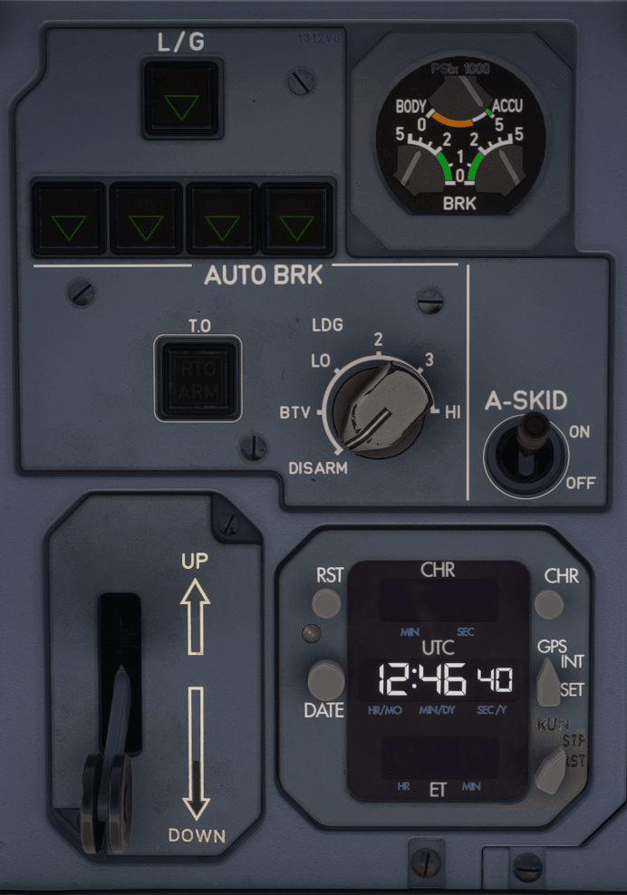

# Center Right Panel

---

[Back to Main Instrument Panel and Glareshield](../overviews/main-glare.md){ .md-button }

---

[//]: # (TODO)

TODO: 

---

[Back to Main Instrument Panel and Glareshield](../overviews/main-glare.md){ .md-button }

---

