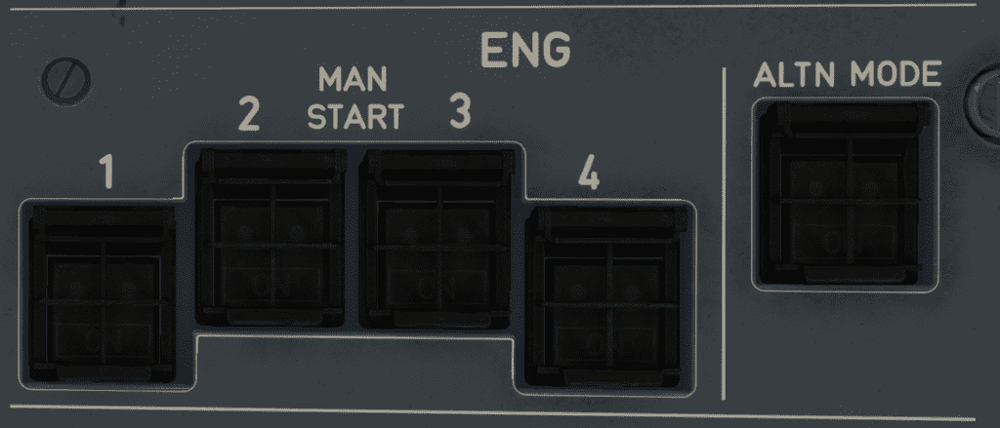

# Engine Manual Start Panel

---

[Back to Overhead](../overviews/ovhd.md){ .md-button }

---

{loading=lazy}

## Description

The Engine Manual Start Panel is used to manually start the engines.

## Usage

### ENG MAN START pb-sw

- ON:
    - During a manual engine start, the start valve opens, provided ENG START selector is set to IGN/START or CRANK.
    - *Note*: The start valve automatically closes when N2 reaches 58.4%.

- OFF:
    - The start valve closes, provided the ENG MASTER lever is set to OFF.
    - This stops the engine start sequence.

---

[Back to Overhead](../overviews/ovhd.md){ .md-button }

---

