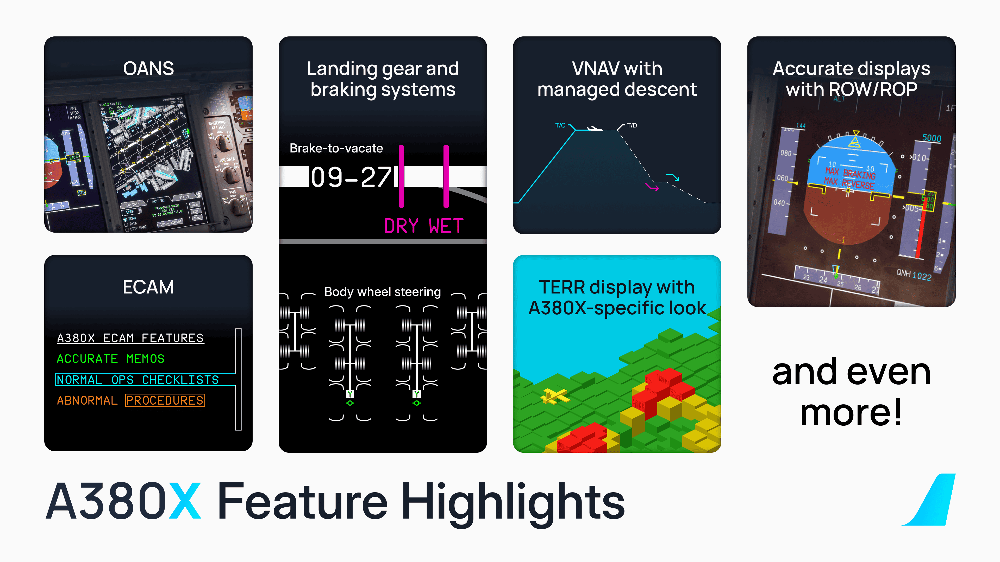

[//]: # (<link rel="stylesheet" href="../../stylesheets/toc-tables.css">)

# A380X Alpha - Release v0.12.0

We are very excited to finally provided our users with our open alpha stage developer preview of the A380X. We have taken steps to ensure at minimum that the aircraft is
capable of an A to B flight on VATSIM.

These release notes are meant to provide an initial outlook into the features available for our very first release of this aircraft.

## Release Feature List

### Flight Management

- [x] Working flight management system (FMS) -> based on the novel FBW **fms-v2**
- [x] Vertical guidance (VNAV) to accurately follow altitude and speed constraints
- [x] Support for all ARINC424 leg types, holdings, missed approaches and diversions
- [x] Separate operation of CAPT and F/O MFD
- [x] Flight management via 17 interactive pages in the MFD

### ECAM / Flight Warning

- [x] Accurate MEMOs for a multitude of systems
- [x] Electronic checklists for normal procedures (checklists) and abnormal sensed procedures (faults)
- [x] Audible callouts such as radio altitude, EGPWS, AUTO BRK OFF, AP disconnection

### Navigation

- [x] Onboard Airport Navigation (OANS) display, including RWY AHEAD advisory
    - 
Requires Navigraph Unlimited Subscription

- [x] Radio altimeters (RAs) simulated as three independent units
- [x] Ground proximity warning system (GPWS) with messages shown on PFD
- [x] Terrain display with A380-specific animations

### Instruments / EFIS

- [x] Accurate representation of PFD, ND, EWD, SD and MFD
- [x] Modern, resource-efficient implementation
- [x] PFD with MEMOs and LIMITATIONs, as well as all flaps and THS indications
- [x] EFIS control panel with filters, range up to 640nm and ZOOM ranges for OANS
- [x] Detailed system displays (SD) on 14 pages
- [x] Three independent Radio Management Panels (RMP) and Two Audio Management Units (AMU)
- [x] Three VHF radios, with simultaneous Rx capability
- [x] QNH pre-selection in the EFIS CP

### Flight Controls

- [x] Flap load relief systems (FLRS) and auto extension/retraction (AES/ARS)
- [x] Accurate hydraulic and electronic actuation of flight control surfaces (except for flaps and slats still to do)
- [x] Triple aileron simulation on each wing, resulting in the “Valse Des Ailerons” (VDA/Aileron Dance)

### Landing Gear / Braking Systems

- [x] Brake-to-Vacate (BTV) functionality
- [x] Runway overrun warning/protection (ROW/ROP)
- [x] Body wheel steering (visual only)
- [x] Gear door hydraulic simulation
- [x] Landing gear gravity extension

### 3D Model and Texturing

- [x] Detailed cockpit, with true-to-life dimensions
- [x] Interactive cockpit elements including moveable seats, windows, window shades, tray tables
- [x] Cockpit switches accurately modeled including guard and fire switch animation
- [x] Working exterior lights (logo, wing, taxi, landing, beacon, strobe)
- [x] Fully modeled main deck and first class (upper deck) cabin
- [x] High-resolution 8K texturing (4K optional) with state-of-the-art PBR and roughness maps
- [x] Sophisticated 3D engine model including custom blended animations with blurred textures for convincing
depiction of engines in operation

### flyPadOS v3 - A380X Capabilities

- [x] Throttle Calibration
- [x] Binding for 4 throttles/2 throttle/1 throttle hardware configuration
- [x] Payload Page for A380
- [x] Main/Upper Deck
- [x] 4 Class Configuration
- [x] Economy, Premium Economy, Business and First Class Suites
- [x] Multiple Gate Boarding (use with GSX OR open M1L, U1L doors etc.) including Priority Boarding
- [x] Triple/Quad Stair GSX config possible* (should work, needs testing)
- [x] Real-Time/Fast/Instant with live seat layout map
- [x] GSX Compatibility
- [x] Refueling Page for A380

### Miscellaneous

- [x] Custom dynamic sounds for engines, flaps, slats, fuel pumps, ventilation fans, and immersive ambient sounds
- [x] Accurate Air Condition/Ventilation system
- [x] Engine and APU fire implemented, with respective abnormal procedures via ECAM
- [x] Accurate implementation of the electrical system
- [x] Accurate implementation of hydraulic core system architecture
- [x] Extensive simulation of fuel transfers (with all pumps and circuits), automatic CG-based transfers
- [x] RAT simulation including visible variable pitch animation
- [x] Cargo doors hydraulic simulation
- [x] Custom physical based flex system for wings/rudder/elevator. Wings simulated as soft bodies and reacting to fuel load.
